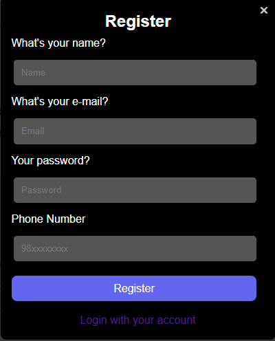
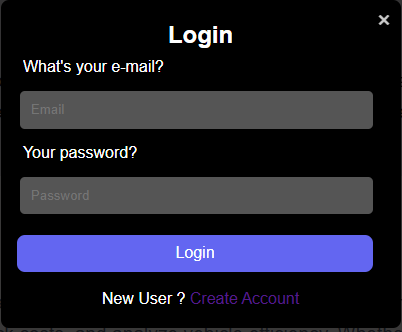
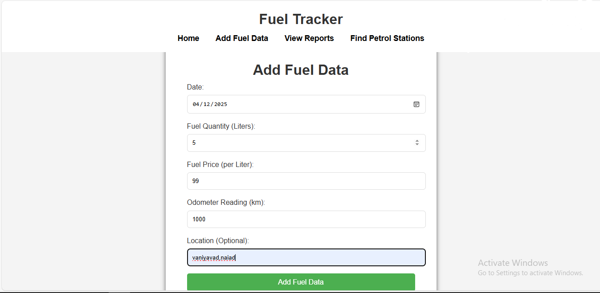
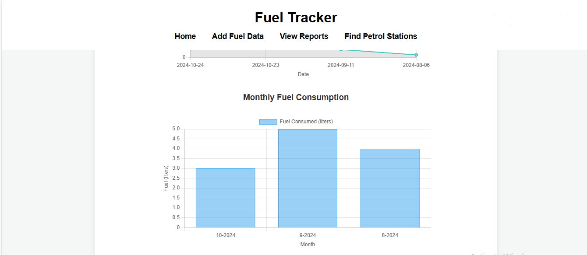
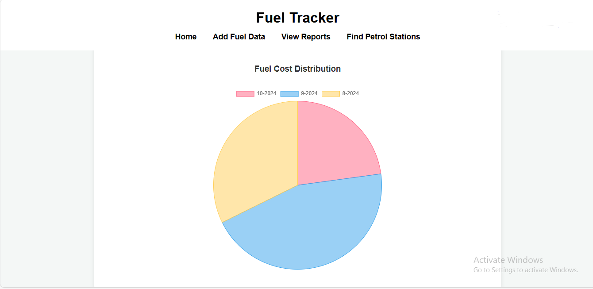
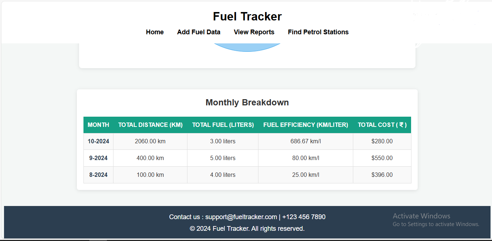

# Fuel-Management-System

# ⛽ Fuel Management System

A simple web-based system for managing fuel stations, tracking fuel data, and generating reports.

## 🔍 Features

- 📊 View and manage fuel reports
- ⛽ Track fuel station data
- ➕ Add new fuel data entries
- Responsive interface using HTML, CSS, and JavaScript

## 🛠️ Tech Stack

- HTML
- CSS
- JavaScript

## 🚀 Getting Started

To run the project locally:

1. **Clone or download** the repository.
2. Open `index.html` in your browser.
3. Navigate through the UI to explore features like:
   - Viewing station details
   - Adding fuel data
   - Viewing reports

## 📸 Screenshots

Register Page :

Login Page :

Add Fuel Data Page :

Fuel Efficiency Over Time Page :

Monthly Fuel Consumption Page :

Fuel Cost Distribution Page

Monthly Breakdown Page

